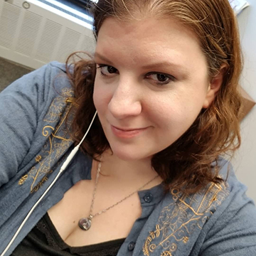

# Deborah Barndt
## ITMD-565 - Fall 2018

## Academic Interests
I am a co-terminal ITM major with a specialization in Software Development. 
I'm interested in designing and web development, so I'm familiar with Adobe
Creative Suite and I'm taking some web development classes to round out my
technical skills.

## Repository Contents
### Github Lab
For the Github lab, I used the GitHub Desktop GUI to clone my ITM private
repo to my own Illinois Tech Repo folder for all my classes. Then I created 
my ITM_565 folder and the class readme file per the instructions. Inside the githublab folder, I added the instructions for the lab and created a basic nodeJS app per the instructions given in the github lab. I learned how to upload my repository to my private repo, how to make commits, push and pull commits, and create a basic node.js app.